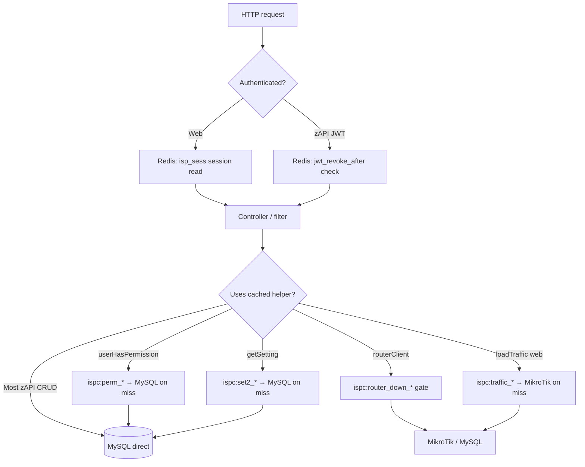

# 01 — Redis: Current State & Architecture (`isp-core`)

> Deep technical reference for **how Redis works today** in this codebase.  
> Companion: [02 — What to use / not use](./02-REDIS-WHAT-TO-USE-AND-NOT-USE.md) | [03 — Improvement roadmap](./03-DATABASE-REDIS-IMPROVEMENT-ROADMAP.md)

---

## 1. Configuration (source of truth)

### 1.1 Environment (`.env`)

| Setting                | Local dev (current)                       | Production option                 |
| ---------------------- | ----------------------------------------- | --------------------------------- |
| `cache.handler`        | `predis`                                  | `predis` or `redis` (phpredis)    |
| `cache.redis.host`     | `127.0.0.1`                               | `tls://….upstash.io`              |
| `cache.redis.port`     | `6379`                                    | `6379`                            |
| `cache.redis.password` | empty                                     | Upstash token                     |
| `cache.redis.timeout`  | `1.0`                                     | `1.5` (remote)                    |
| `session.driver`       | `App\Session\Handlers\PredisHandler`      | same                              |
| `session.savePath`     | `tcp://127.0.0.1:6379?…&prefix=isp_sess:` | `tls://…?auth=…&prefix=isp_sess:` |

**Files:** `isp-core/.env`, `isp-core/app/Config/Cache.php`, `isp-core/app/Config/Session.php`

### 1.2 Key prefix separation (single Redis DB)

Upstash and local dev use **database 0** only. Separation is by **prefix**, not `SELECT 1/2/3`:

| Prefix      | Role                                                | Handler                         |
| ----------- | --------------------------------------------------- | ------------------------------- |
| `ispc:`     | App cache (CI4 `cache()` + `Config\Cache::$prefix`) | `UpstashPredisHandler` / Predis |
| `isp_sess:` | Web sessions                                        | `PredisHandler`                 |

**Never run `cache()->clean()` / `FLUSHDB`** on a shared DB — it wipes sessions too. Use `SCAN` + delete `ispc:*` only.

### 1.3 Fail-over behavior

| Layer                 | Redis down  | Behavior                                                                                      |
| --------------------- | ----------- | --------------------------------------------------------------------------------------------- |
| **Cache**             | unreachable | Falls back to `backupHandler = file` (`Cache.php`) — app keeps running, no cross-worker cache |
| **Sessions**          | unreachable | **Login breaks** — no file fallback when `PredisHandler` is configured                        |
| **All cache helpers** | error       | Fail-safe: permissions/settings/flags fail open or fall through to MySQL                      |

---

## 2. Request flow (not “Redis first everywhere”)

**Summary:** Redis is **selective**. Default path is still **MySQL** (or MikroTik for router I/O).

---

## 3. Complete cache key catalog

All app-cache keys are stored as CI4 **Redis hashes** with fields `__ci_type` and `__ci_value` (visible in Redis Inspector).

| Logical key (before `ispc:` prefix) | TTL           | Written by                              | Read by                                            | Invalidation                                                                  |
| ----------------------------------- | ------------- | --------------------------------------- | -------------------------------------------------- | ----------------------------------------------------------------------------- |
| `perm_{version}_{md5}`              | 30s           | `user_helper.php` `userHasPermission()` | Sidebar, `PermissionCheck` filter, ~60 views       | `bumpPermissionCacheVersion()` on `Permission` / `CustomAccess` model changes |
| `perm_cache_version`                | 30d           | `bumpPermissionCacheVersion()`          | `permissionCacheVersion()`                         | bumped on permission writes                                                   |
| `set2_{version}_{md5}`              | 60s           | `utility_helper.php` `getSetting()`     | Any `getSetting()` caller (web + zapi payment/SMS) | `bumpSettingsCacheVersion()` on `setSetting()`                                |
| `settings_cache_version`            | 30d           | `bumpSettingsCacheVersion()`            | `settingsCacheVersion()`                           | bumped on settings writes                                                     |
| `flag_{name}`                       | 1y default    | `flag_helper.php` `setFlag()`           | `flag()`                                           | `clearFlag()`                                                                 |
| `jwt_revoke_after_{userId}`         | ≥ refresh TTL | `token_helper.php` `revokeUserTokens()` | `JwtAuthFilter`, `AuthController::refreshToken`    | expires naturally; set on password change/logout                              |
| `traffic_router_{id}_{hash}`        | 5s            | `Routers::loadTraffic()`                | same                                               | time-based                                                                    |
| `traffic_user_{id}_{hash}`          | 5s            | `Routers::UsersloadTraffic()`           | same                                               | time-based                                                                    |
| `dash_sadmin_{userId}`              | 30s           | `Dashboard::sadminData()`               | same (under degrade flags)                         | time-based                                                                    |
| `router_down_{routerId}`            | 45s           | `router_helper.php` `routerClient()`    | same + all `routerClient()` callers                | auto-expire; deleted on successful connect                                    |
| `rc_cooldown_{action}_{userId}`     | per action    | `CustomerBaseService::withinCooldown()` | autofix / router-control                           | time-based                                                                    |
| `healthz_ping`                      | 5s            | `Health::checkCache()`                  | `/healthz`                                         | probe only                                                                    |
| `current_reseller_id`               | 3600s         | `CronJob.php` (write)                   | commented legacy read                              | time-based                                                                    |
| Throttler keys                      | per filter    | `ThrottleFilter` + CI4 Throttler        | `auth/login/validate`                              | time-based; **inactive** unless `flag('login_throttle')`                      |

**Session keys:** `isp_sess:{sessionId}` — plain **string** (PHP session serialized), TTL = `session.expiration` (7200s).

---

## 4. Web (`app/`) — what uses Redis

### 4.1 Sessions (every authenticated web page)

| Item        | Detail                                         |
| ----------- | ---------------------------------------------- |
| **Driver**  | `app/Session/Handlers/PredisHandler.php`       |
| **When**    | Every request with `authcheck` filter          |
| **Data**    | `user_id`, `user_role`, `admin_id`, CSRF, etc. |
| **Pattern** | Redis only (not a cache-then-DB pattern)       |

### 4.2 Permissions (`userHasPermission`)

| Item       | Detail                                                                                      |
| ---------- | ------------------------------------------------------------------------------------------- |
| **File**   | `app/Helpers/user_helper.php` (~line 1285–1377)                                             |
| **Layers** | L1: per-request `static` memo → L2: Redis → MySQL (`permissions`, `custom_access`)          |
| **Volume** | Sidebar alone: ~25 calls/page → without L2: 50–125 queries                                  |
| **Routes** | Any route with `permissioncheck:…` filter (`app/Config/Routes.php`)                         |
| **Bust**   | `app/Models/Permission.php`, `app/Models/CustomAccess.php` → `bumpPermissionCacheVersion()` |

**Not implemented:** full permission **map** cache (`perm:{user_id}` → entire array) from design doc C1 — only per-decision keys exist.

### 4.3 Settings (`getSetting`)

| Item               | Detail                                                          |
| ------------------ | --------------------------------------------------------------- |
| **File**           | `app/Helpers/utility_helper.php`                                |
| **Layers**         | L1 static → L2 Redis → `settings` table + `setting()` library   |
| **Skipped for L2** | `isSensitiveSettingKey()` — SMS, SMTP, payment, API keys, logos |
| **zapi callers**   | `PaymentService`, `SupportService`, `VoiceSmsService`           |

### 4.4 Router traffic (web only)

| Route                                 | Controller                  | Cache                           |
| ------------------------------------- | --------------------------- | ------------------------------- |
| `GET routers/load-traffic/{id}`       | `Routers::loadTraffic`      | Read-through 5s + degrade flags |
| `GET routers/users_load-traffic/{id}` | `Routers::UsersloadTraffic` | Read-through 5s                 |

**Flags** (`flag_helper.php`): `degrade_mode`, `live_router_widgets` — skip MikroTik, return empty shape.

### 4.5 Dashboard

| Route                           | Behavior                                                                                                                        |
| ------------------------------- | ------------------------------------------------------------------------------------------------------------------------------- |
| `GET api/dashboard/sadmin-data` | Always computes ~35 queries; **saves** `dash_sadmin_{id}` 30s; **reads** cache only when `degrade_mode` or `!dashboard_polling` |

### 4.6 Circuit breaker (`routerClient`)

| Item        | Detail                                                                                    |
| ----------- | ----------------------------------------------------------------------------------------- |
| **File**    | `app/Helpers/router_helper.php`                                                           |
| **Key**     | `router_down_{id}`                                                                        |
| **Used by** | Web routers, zapi customer/reseller provisioning, captive portal, subscription sync, etc. |

### 4.7 Auth & ops

| Feature                          | File                                                     | Redis use                                         |
| -------------------------------- | -------------------------------------------------------- | ------------------------------------------------- |
| JWT revoke (web password change) | `token_helper.php`, `AuthController.php`, `Settings.php` | writes `jwt_revoke_after_`*                       |
| Login throttle                   | `ThrottleFilter.php`                                     | Throttler buckets; off by default                 |
| Health                           | `GET /healthz`                                           | ping cache key                                    |
| Queue depth                      | `Health.php`                                             | **MySQL** `jobs` table via `JobQueue` — not Redis |
| Redis Inspector UI               | `GET /system/redis-cache`                                | read-only SCAN; `info@isppaybd.com` only          |

---

## 5. Mobile API (`zapi/`) — what uses Redis

### 5.1 Always (JWT protected routes)

| Filter    | File                                  | Redis read                 |
| --------- | ------------------------------------- | -------------------------- |
| `zapijwt` | `zapi/Core/Filters/JwtAuthFilter.php` | `tokensRevokedAfter($sub)` |

Applies to essentially all `api/customer/`*, `api/reseller/`*, and authenticated `api/common/*` routes (`zapi/config/routes/*.php`).

### 5.2 Cooldowns only

| Route group                     | Service                | Keys                                                       |
| ------------------------------- | ---------------------- | ---------------------------------------------------------- |
| `api/customer/router-control/*` | `RouterControlService` | `rc_cooldown_router_reboot_*`, `rc_cooldown_wifi_change_*` |
| `api/customer/autofix/*`        | `AutoFixService`       | `rc_cooldown_*`                                            |

### 5.3 Indirect (via `app/` helpers)

| Helper           | zapi usage                                                                             |
| ---------------- | -------------------------------------------------------------------------------------- |
| `routerClient()` | Reseller customer CRUD, subscription, router fetch, captive portal, common PPPoE check |
| `getSetting()`   | Payment gateways, SMS, support templates                                               |

### 5.4 Not cached in zapi (gaps)

| Endpoint                                     | Web equivalent                    | zapi status                                       |
| -------------------------------------------- | --------------------------------- | ------------------------------------------------- |
| `GET api/customer/routers/load-traffic/{id}` | `Routers::loadTraffic` (5s cache) | **No response cache** — `RouterTrafficController` |
| `GET api/customer/users-load-traffic/{id}`   | `UsersloadTraffic` (5s cache)     | **No response cache**                             |
| `GET api/reseller/dashboard/{id}`            | —                                 | **No cache** — `DashboardService`                 |
| Customer/reseller lists                      | —                                 | Direct MySQL (N+1 risk)                           |

---

## 6. What is NOT Redis (common confusion)

| Name                          | Storage                | Notes                               |
| ----------------------------- | ---------------------- | ----------------------------------- |
| `user_router_data` table      | **MySQL**              | PPPoE secret cache for customers    |
| `reward_wallets` table        | **MySQL**              | Denormalized points balance         |
| `RewardConfigService::$cache` | **PHP array**          | In-request only                     |
| `TrafficMonitorConfig` static | **Process memory**     | Skip-prefix lists                   |
| `getUserById()`               | **MySQL every call**   | No Redis L2 (planned C2, not coded) |
| Job queue                     | **MySQL `jobs` table** | `App\Services\JobQueue`             |

---

## 7. Infrastructure files

| File                                          | Purpose                                             |
| --------------------------------------------- | --------------------------------------------------- |
| `app/Config/Cache.php`                        | Handler, prefix `ispc:`, redis block, backup `file` |
| `app/Config/Session.php`                      | Session driver docs + defaults                      |
| `app/Libraries/UpstashRedisConfig.php`        | TLS DSN parse, Predis client factory                |
| `app/Cache/Handlers/UpstashPredisHandler.php` | Cache handler wrapper                               |
| `app/Session/Handlers/PredisHandler.php`      | Session handler                                     |
| `app/Libraries/RedisInspector.php`            | Ops UI backend (paginated SCAN)                     |
| `app/Commands/RedisCheck.php`                 | `php spark redis:check` (phpredis)                  |

---

## 8. Tests

| Test                                 | Covers                  |
| ------------------------------------ | ----------------------- |
| `tests/unit/PermissionCacheTest.php` | Permission version bust |
| `tests/unit/SettingsCacheTest.php`   | Settings version bust   |
| `tests/unit/TokenRevocationTest.php` | JWT revoke stamp        |
| `tests/unit/FlagHelperTest.php`      | Kill-switch flags       |

---

## 9. Performance impact (implemented vs potential)

| Area                   | Queries/load before cache | With current Redis       | With full plan (C1–C8) |
| ---------------------- | ------------------------- | ------------------------ | ---------------------- |
| Sidebar permissions    | 50–125/page               | ~1–5 Redis reads/page    | ~0–1                   |
| `getSetting` hot paths | 2–4/call                  | 0–1 Redis hit            | same                   |
| Web router poll        | MikroTik every 3s         | ~1 hit per 5s            | same                   |
| sAdmin dashboard poll  | ~35 SQL/poll              | still ~35 unless degrade | ~0 (30s cache)         |
| zAPI traffic           | MikroTik every call       | circuit breaker only     | 5s cache parity        |
| `getUserById`          | 1 SQL/call                | no change                | 1 Redis hit            |

**Overall implementation score:** ~**40–50%** of designed Redis benefit is live in code.

---

## 10. Monitoring & debugging

1. **Web UI:** `/system/redis-cache` (paginated, filter by `ispc:`* / `isp_sess:`*)
2. **CLI:** `redis-cli --scan --pattern 'ispc:*'`
3. **Health:** `GET /healthz` → `checks.cache`
4. **Spark:** `php spark redis:check` (validates phpredis path, not Predis session path)

---

*Next: [02 — What to use and not use](./02-REDIS-WHAT-TO-USE-AND-NOT-USE.md)*